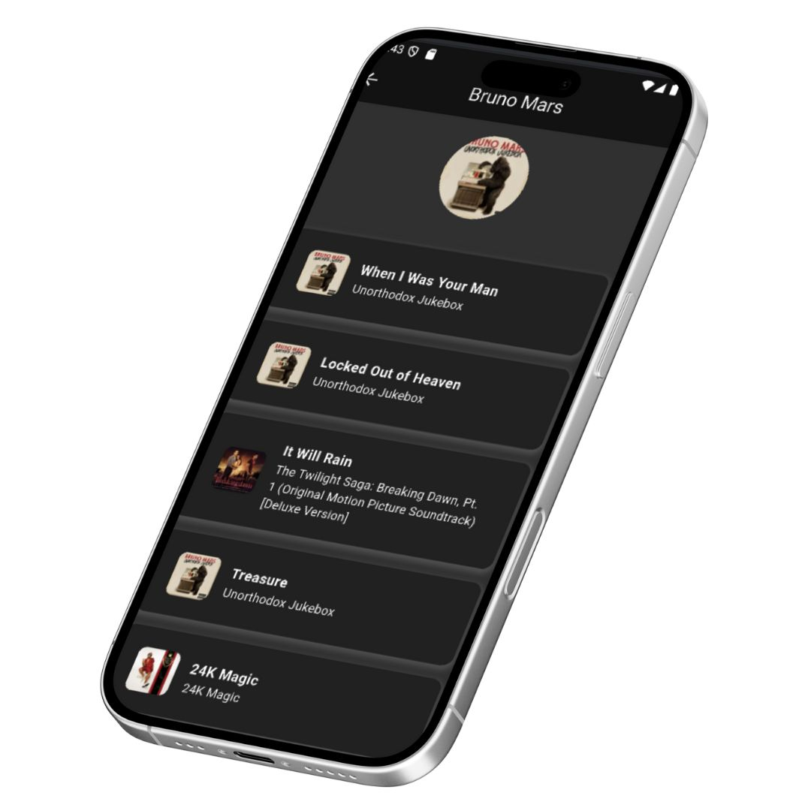
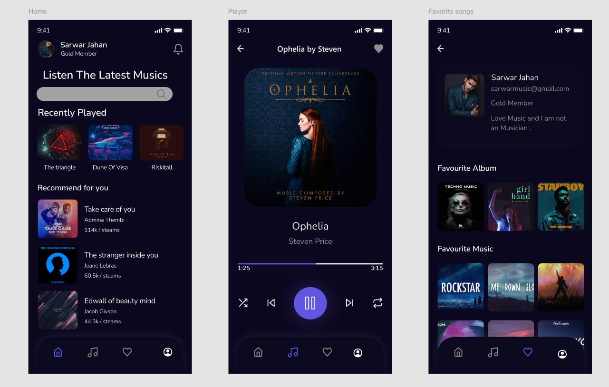

# 🎵 Music App - Flutter  

📌 **Overview**  
A Flutter-based mobile application built with **Dart** using **Android Studio**. This app leverages the **iTunes API** by Apple to provide a seamless and personalized music experience. Whether you're exploring new music or creating your favorite playlist, this app has you covered!  

---

## ✨ **Key Features**  
- **Browse and Explore**: Discover albums, artists, and songs effortlessly.  
- **Personalized Playlist**: Add songs to your favorites and enjoy a curated music experience.  
- **Fully Functional Music Player**: Built using the `just_audio` package for smooth playback.  
- **Dark/Light Mode**: Customize your UI experience with a toggleable theme.  
- **Intuitive Navigation**: Smooth bottom navigation for a user-friendly interface.  
- **Efficient Local Storage**: Utilizes `Shared Preferences` to save user preferences and data locally.  

---

## 🛠️ **Technologies Used**  
- **Flutter**: For building a cross-platform mobile application.  
- **Dart**: The programming language used for development.  
- **Android Studio**: The primary IDE for development and debugging.  
- **iTunes API**: Integrated to fetch music data (albums, artists, songs).  
- **just_audio**: A Flutter package for audio playback.  
- **Shared Preferences**: For local storage of user data and preferences.  

---

## 📸 **Screenshots**  
Here are some screenshots of the application in action:  

| **Home Screen** | **Dark Mode** | **Album Screen** | **Player Screen** | **Figma Design** |  
|-----------------|---------------|------------------|-------------------|------------------|  
|  |  |  |  |  |  

---

## 🚀 **Getting Started**  

### Prerequisites  
- **Flutter SDK** installed on your machine.  
- **Android Studio** or any preferred IDE.  
- An API key for the **iTunes API** (if required).  

### Installation  
1. **Clone the repository**:  
   ```bash
   git clone https://github.com/DeshanJagoda/MusicApp.git
